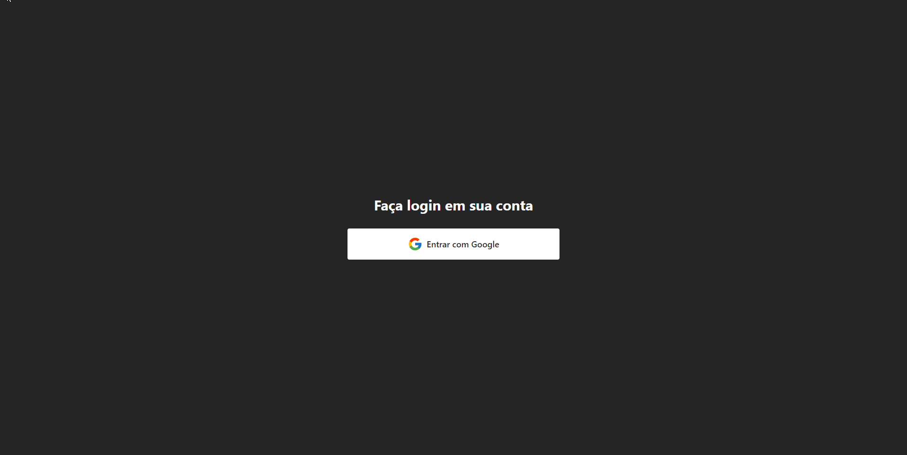

# Microsoft Teams - Clone

 

O projeto é uma recriação do Microsoft Teams versão web, utilizando o ReactJS, Tailwind e Firebase com foco nas funcionalidades de chat. Foi desenvolvido em [playlist completa no meu canal do YouTube](https://youtube.com/playlist?list=PL3dK8rJsjDOKwZayMz_p6cqkU0TMBc1ZO) ensinando a utilizar essas ferramentas e recriar a aplicação do zero. Algumas de suas funcionalidades:

- [x] Autenticação com Firebase
- [x] Login social
- [x] Envio de mensagens
- [x] Leitura de mensagens em tempo real
- [x] Comunicação com banco de dados Firestore

## Tecnologias e ferramentas utilizadas
- ReactJS (Vite)
- Tailwind CSS
- TypeScript
- Firebase
- React Router DOM

Para acessar o projeto em produção [Clique aqui!](clone-microsoft-teams.vercel.app)